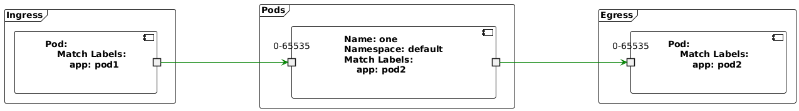
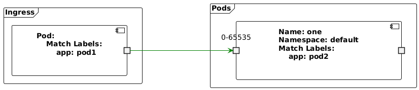
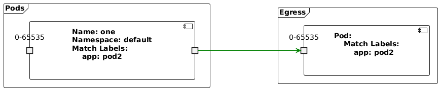
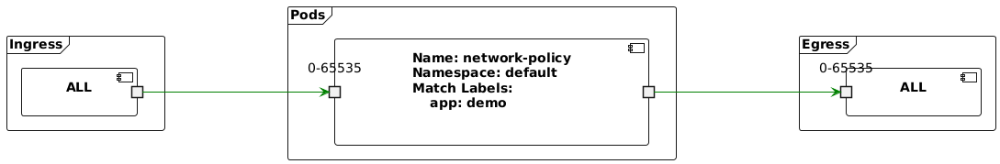
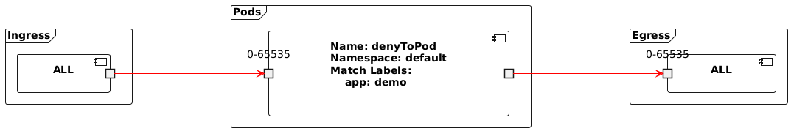
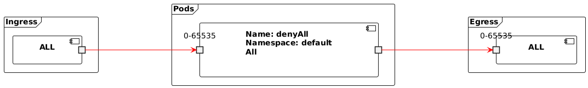
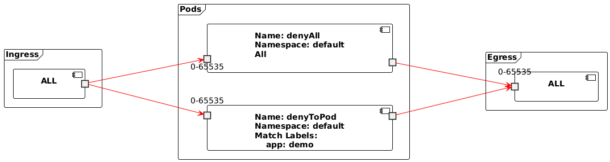
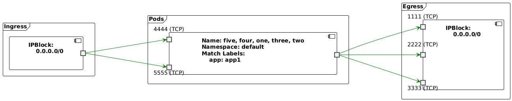
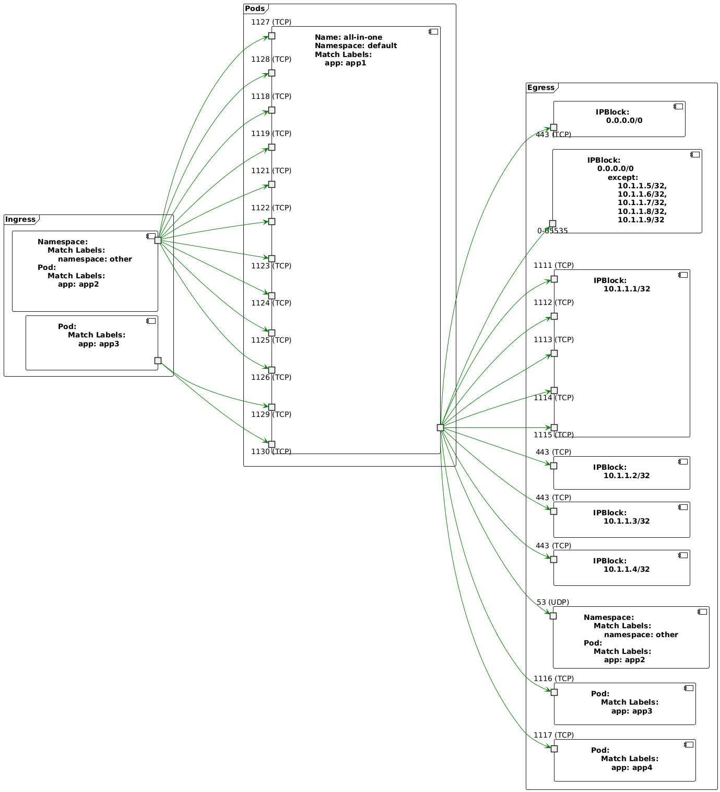

# NPV - NetworkPolicyViewer

This project fetches NetworkPolicy resources from the Kubernetes cluster
identified by the current `KUBECONFIG` environment variable and prints a
[PlantUML](http://www.plantuml.com) component diagram to stdout. Note, use at
least PlantUML version 2024.8 for best results on large diagrams.

## Install

`go install github.com/mrxk/npv@latest`

## Usage

```
npv - Network Policy Visualizer

Usage:
        npv visualize [(--namespace=<namespace>...|--file=<file>...)] [--out=<out>] [(--ingress-only|--egress-only)] [--linetype=<type>]

Options:
        --namespace=<namespace> Namespace containing Network Policies to visualize
        --file=<file>           Path to file containing Network Policies to visualize
        --out=<out>             Path to write visualiztion (- for stdout) (default: -)
        --ingress-only          Visualize only ingress rules
        --egress-only           Visualize only egress rules
        --linetype=<type>       Specify a line type (polyline or ortho)
```

If not given `--namespace` or `--file`, all NetworkPolicy resources in the
cluster identified by the current `KUBECONFIG` environment variable will be
fetched. Multiple `--namespace` or `--file` options can be provided to include
the NetworkPolicy resources from multiple namespaces or files in one graph.
Globs can be passed to `--file` although care must be taken to ensure the shell
does not expand the glob before executing `npv`.  The output can be filtered to
only ingress or egress rules with either `--ingress-only` or `--egress-only`
options.

The `--linetype` can be left unspecified (the default) or can be `polyline` or
`ortho`.  When specified this will become the linetype skinparam in the
resulting PlantUML output.  This can be useful in very large diagrams.

The output can be saved and processed with PlantUML or piped directly to it.

`npv visualize --namespace default | java -jar plantuml-1.2024.8.jar -pipe > default.png`

PlantUML can be downloaded from
[https://plantuml.com/download](https://plantuml.com/download).

## Build

1. Clone the project
1. Build with `go build`

## Examples



















